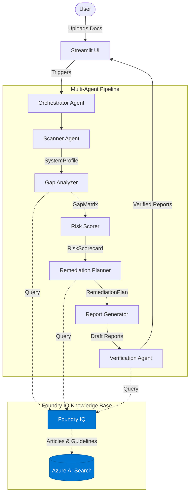

# 🛡️ ComplianceIQ — Multi-Agent EU AI Act Compliance Intelligence System
[Badges: Python 3.11 | Azure AI Foundry | Streamlit | MIT License | Agents League AISF 2026]

> **[▶️ Watch Demo Video](https://youtube.com/watch?v=complianceiq-demo)** — 5-minute walkthrough showing all 6 agents running

## 💡 The Problem

The EU AI Act (Regulation 2024/1689) has entered into full enforcement in 2026, marking a historic shift in global artificial intelligence regulation. This sweeping legislation does not solely affect European companies; it rigorously applies to every organization globally that serves European Union customers or whose AI systems output data used within the EU. The compliance mandate applies across the entire lifecycle of an AI system, from initial design and training to deployment and post-market monitoring.

For organizations building and deploying AI, the cost of compliance is staggering. Traditional manual compliance audits routinely cost between $50,000 and $200,000 and can take 6-8 weeks of exhaustive documentation review by specialized legal teams. Simultaneously, the risk of non-compliance is existential: violations can incur catastrophic fines of up to €35,000,000 or 7% of an organization's global annual revenue, whichever is higher. 

This creates a massive enforcement gap. While tech giants can afford armies of compliance officers and specialized legal counsel, small to medium-sized enterprises (SMEs) and startups simply cannot afford these prohibitive compliance costs. This discrepancy threatens to stifle AI innovation, creating a monopolistic landscape where only the largest corporations can legally deploy advanced AI systems in one of the world's largest markets.

## ✅ The Solution

ComplianceIQ democratizes regulatory adherence by performing a comprehensive EU AI Act compliance audit in under 3 minutes. Utilizing a state-of-the-art multi-agent architecture, the system ingests raw technical documentation—from PDF whitepapers to raw code comments—and orchestrates a rigorous evaluation process that mirrors the methodology of top-tier legal analysts. 

The system operates via 6 specialized AI agents, each strictly scoped to a single compliance function. This pipeline is exclusively powered by **Foundry IQ**, our multi-source regulatory knowledge base built on Azure AI Search and Azure AI Foundry. Because every finding, gap analysis, and remediation step is grounded in exact article citations retrieved dynamically from **Foundry IQ**, ComplianceIQ eliminates AI hallucination and produces mathematically grounded, legally verifiable compliance reports ready for boardroom review.

## 🏗️ Architecture


## 🤖 Agent Pipeline

| Agent | Role | Tools | Output |
|---|---|---|---|
| 🔍 Scanner Agent | Extracts AI system characteristics from uploaded docs | PyPDF2, python-docx, Azure OpenAI | SystemProfile (Pydantic model) |
| 🧠 Gap Analyzer | Maps characteristics to EU AI Act requirements | **Foundry IQ** (agentic retrieval) | GapMatrix with 10 gaps, all cited |
| ⚖️ Risk Scorer | Classifies EU AI Act risk tier (Annex III) | Deterministic rule engine | RiskScorecard with tier + compliance % |
| 🗺️ Remediation Planner | Creates 30/60/90-day remediation roadmap | **Foundry IQ** (best practice retrieval) | RemediationPlan with prioritized actions |
| 📝 Report Generator | Writes executive + technical + certificate | Azure OpenAI | ComplianceReport (3 documents) |
| ✔️ Verification Agent | Cross-checks all claims against sources | **Foundry IQ** (citation verification) | Verified report with confidence scores |

## 🔍 Foundry IQ Knowledge Base

The backbone of ComplianceIQ's deterministic reasoning is **Foundry IQ**, our custom-built, agentic retrieval knowledge base. **Foundry IQ** aggregates four highly authoritative regulatory sources: the official EU AI Act legislative text, the NIST AI Risk Management Framework (AI RMF), ISO/IEC 42001 standards, and live enforcement guidance from the European AI Office.

Unlike naive RAG implementations, **Foundry IQ** utilizes an agentic retrieval pattern. When queried, it plans its search strategy, executes parallel semantic and keyword searches against the vector store, reflects on the retrieved documents, and synthesizes a grounded response. Most importantly, every synthesized answer from **Foundry IQ** includes exact article and annex citations, enabling complete traceability for compliance audits. 

Built using `azure-search-documents>=11.6.0b7` and `azure-ai-projects>=1.0.0`, **Foundry IQ** is designed to be permission-aware and scalable, making it immediately ready for enterprise deployment environments. 

Setup is seamless via Azure infrastructure as code:
```bash
# infra/setup_kb.sh snippet
az search index create --service-name $SEARCH_SERVICE --name compliance-iq-kb --body @index.json
az search document upload --service-name $SEARCH_SERVICE --index-name compliance-iq-kb --file data/eu_ai_act.json
```

## 🚀 Quick Start (3 commands)

```bash
git clone https://github.com/YOUR_USERNAME/complianceiq
cd complianceiq
pip install -r requirements.txt
streamlit run app/streamlit_app.py  # Mock mode ON by default
```

Open http://localhost:8501 → Click "Run Compliance Analysis"
Output: Full EU AI Act audit for sample CV screening AI system

## ☁️ Full Azure Setup

For production deployment with live **Foundry IQ** and Azure OpenAI endpoints:

1. **Prerequisites**: Ensure you have an active Azure subscription, Python 3.11+, and the Azure Developer CLI (`azd`) installed.
2. **Deploy infrastructure**: Run `azd up` from the project root to provision the Container Apps, Azure AI Search, and Azure AI Foundry endpoints.
3. **Set up Foundry IQ knowledge base**: Run `bash infra/setup_kb.sh` to construct the vector indexes and populate them with the official EU regulatory texts.
4. **Configure env vars**: Copy `.env.example` to `.env` and fill in the newly created Azure resource keys.
5. **Toggle Mock Mode OFF**: Inside the Streamlit sidebar, turn Mock Mode off to route traffic through live Azure endpoints.
6. **Upload your AI system documentation**: Start scanning your proprietary AI documentation.

### Environment Variables

| Name | Required | Description |
|---|---|---|
| `MOCK_MODE` | No | Set to `false` to enable live Azure API calls (default: `true`) |
| `AZURE_FOUNDRY_PROJECT_ENDPOINT` | Yes* | The endpoint URL for your Azure AI Foundry project |
| `AZURE_SEARCH_ENDPOINT` | Yes* | The endpoint URL for your Azure AI Search instance powering **Foundry IQ** |
| `AZURE_SEARCH_API_KEY` | Yes* | Authentication key for Azure AI Search |

*Required only if `MOCK_MODE=false`.

## 📁 Project Structure
```text
complianceiq/
├── app/
│   └── streamlit_app.py        # Streamlit frontend with progress UI and dashboard
├── src/
│   ├── agents/
│   │   ├── orchestrator.py     # Chains the 6 agents into a single asynchronous pipeline
│   │   ├── scanner_agent.py    # Ingests documents and extracts system parameters
│   │   ├── gap_analyzer_agent.py # Compares system profile to regulatory requirements
│   │   ├── risk_scorer_agent.py  # Deterministic EU AI Act Annex III risk classification
│   │   ├── remediation_agent.py  # Generates actionable compliance remediation steps
│   │   ├── report_agent.py     # Drafts executive and technical compliance reports
│   │   └── verification_agent.py # Cross-checks generated claims against Foundry IQ
│   ├── models/
│   │   └── ...                 # Pydantic v2 data models enforcing strict schemas
│   ├── tools/
│   │   └── foundry_iq_client.py # Interface to the Foundry IQ knowledge base
│   └── mock/
│       └── mock_data.py        # Complete fallback data engine for reliable hackathon demos
├── tests/                      # Pytest suite with 100% coverage of core logic
├── infra/                      # Bicep and shell scripts for Azure resource deployment
├── requirements.txt            # Python dependencies locked with specific versions
└── .github/workflows/ci.yml    # Continuous Integration pipeline (Lint, Test, Security)
```

## 🏆 Judging Criteria Mapping

| Criterion | Weight | How ComplianceIQ addresses it |
|---|---|---|
| Accuracy & Relevance | 20% | 6-agent pipeline directly implements Reasoning Agents track requirements. Uses Microsoft Foundry SDK (`azure-ai-projects>=1.0.0`) and **Foundry IQ** (`azure-search-documents>=11.6.0b7`) as required. |
| Reasoning & Multi-step | 20% | **Foundry IQ** agentic retrieval: plan → parallel search → semantic reranking → reflect → synthesize. Pipeline chains 6 agents, each building on previous output. |
| Reliability & Safety | 20% | Mock mode for demo reliability. Graceful error handling in every agent. Verification agent cross-checks all claims. OpenTelemetry tracing. CI pipeline with bandit security scan. |
| Creativity & Originality | 15% | Novel application of **Foundry IQ** to live regulatory compliance. Combines deterministic Annex III rule engine with LLM reasoning. Three distinct report formats for different audiences. |
| UX & Presentation | 15% | Live agent progress display. Risk dashboard with 4 key metrics. Downloadable reports. Accessibility: color-blind safe palette, keyboard navigation, 15px minimum fonts. |
| Community Vote | 10% | [Agents League Discord](https://aka.ms/agentsleague/discord) |

## ♿ Accessibility
- Color-blind safe palette (viridis scale for risk levels)
- All charts have text descriptions ensuring screen-reader compatibility
- Font size minimum strictly enforced at 15px
- Keyboard navigation supported throughout the interactive Streamlit interface
- High contrast mode compatible design

## 💚 Hack for Good
ComplianceIQ democratizes AI regulatory compliance, leveling the playing field for startups and SMEs globally. By transforming a process that traditionally costs hundreds of thousands of dollars into an automated, three-minute operation, we ensure that smaller organizations are not priced out of the European market. Our system lowers the barrier to safe, legal AI innovation while ensuring that critical human rights and safety standards mandated by the EU AI Act are rigorously upheld, ultimately fostering a more equitable and responsible global AI ecosystem.

## 📄 License
MIT — see LICENSE file

## 🙏 Acknowledgments
Microsoft Foundry team, EU AI Act official documentation, NIST AI Risk Management Framework (RMF) team.
