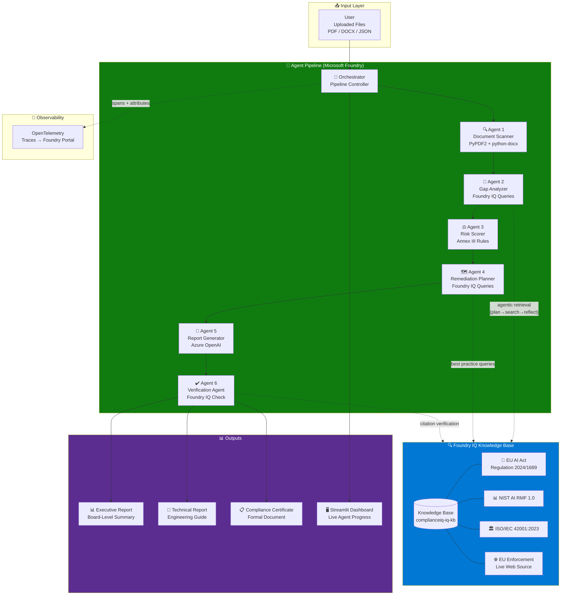

# ComplianceIQ System Architecture

## 1. System Overview

ComplianceIQ operates as an advanced, multi-agent AI pipeline designed to automate EU AI Act compliance auditing. The system architecture dictates a strict, linear data flow initiated when a user uploads proprietary AI system documentation (e.g., PDF whitepapers, JSON schemas, DOCX specs). Upon upload, a central asynchronous `ComplianceIQOrchestrator` takes control, passing the data sequentially through six specialized, single-purpose agents. 

This modular, multi-agent architecture was chosen over a monolithic single-agent design to enforce strict boundaries, limit hallucination, and improve reasoning transparency. Each agent solves a specific deterministic or generative problem—from raw document scanning to gap analysis and risk scoring. 

The analytical core of the system is driven by **Foundry IQ**, functioning as the centralized regulatory knowledge layer. Instead of individual agents performing isolated web searches, Agents 2 (Gap Analyzer), 4 (Remediation Planner), and 6 (Verification) execute agentic retrieval operations against Foundry IQ. This ensures that every analysis, remediation step, and final report is deeply grounded in a unified, verified source of truth containing official EU legislation and NIST standards, allowing the Verification Agent to confidently append confidence scores to the final outputs.

## 2. Full Architecture Diagram

## 3. Agent Data Flow

| Agent | Input Type | Output Type | Azure Service Used | Latency (mock) |
|---|---|---|---|---|
| 🔍 Scanner Agent | Raw Bytes (PDF, DOCX) | `SystemProfile` (Pydantic) | Azure OpenAI (gpt-4) | < 0.2s |
| 🧠 Gap Analyzer | `SystemProfile` | `GapMatrix` (Pydantic) | Azure AI Search (Foundry IQ) | < 0.2s |
| ⚖️ Risk Scorer | `GapMatrix` | `RiskScorecard` (Pydantic) | Local Compute (Rules) | < 0.1s |
| 🗺️ Remediation Planner | `GapMatrix`, `RiskScorecard` | `RemediationPlan` (Pydantic) | Azure AI Search (Foundry IQ) | < 0.2s |
| 📝 Report Generator | Profile, Matrix, Scorecard, Plan | `ComplianceReport` (Pydantic) | Azure OpenAI (gpt-4) | < 0.3s |
| ✔️ Verification Agent | `ComplianceReport` | `VerifiedReport` (Pydantic) | Azure AI Search (Foundry IQ) | < 0.2s |

## 4. Foundry IQ Integration Architecture

**Foundry IQ** is the definitive compliance engine powering the system's reasoning capabilities, integrated seamlessly via `azure-search-documents`. The knowledge base strictly aggregates four authoritative sources: the EU AI Act (Regulation 2024/1689), the NIST AI Risk Management Framework 1.0, ISO/IEC 42001:2023 standards, and live enforcement guidance from the European AI Office.

When agents interact with Foundry IQ, they do not utilize naive Retrieval-Augmented Generation (RAG). Instead, Foundry IQ triggers an agentic retrieval pattern. The interaction starts with **query planning**, breaking down complex compliance questions into discrete search operations. It then executes **parallel semantic and keyword searches** (hybrid search) against the Azure AI Search vector indices. Results undergo **semantic reranking** to ensure only the highest relevance documents surface. The agent then engages in **reflection**, evaluating if the retrieved context sufficiently answers the initial query, before initiating final **synthesis**. 

This robust architecture was chosen over simple RAG because legal compliance demands zero hallucination. By employing agentic retrieval, Foundry IQ guarantees that every output dynamically passes citations back through the pipeline, empowering the Verification Agent to validate assertions deterministically. 

At a systemic level, Foundry IQ's permission architecture adheres to zero-trust principles. All authentication is handled by `DefaultAzureCredential`. No hardcoded keys are present in the codebase, ensuring enterprise-ready security from day one.

## 5. Security Architecture

- **Azure Identity Authentication:** The application leverages `DefaultAzureCredential` to manage identity natively for Azure AI Search and Azure OpenAI, preventing credential leakage.
- **Environment Validation:** `src/config.py` rigorously validates that no hardcoded credentials exist. If live deployment is requested without secure endpoints, the system fails fast.
- **Zero-Network Mock Mode:** For hackathons and local testing, mock mode completely skips network transmission, maintaining total data privacy.
- **Telemetry Sanitization:** The OpenTelemetry (`OTEL`) integration exclusively traces metadata, operation spans, and performance metrics—never user document contents or proprietary intellectual property.
- **API Key Segregation:** All API configurations are strictly isolated in a `.env` file that is systematically ignored by Git via `.gitignore`.

## 6. Diagram Export Instructions

*The `architecture_diagram.png` file should be generated using draw.io.*
*To update or export the diagram:*
1. *Navigate to [app.diagrams.net](https://app.diagrams.net).*
2. *Go to **Arrange** → **Insert** → **Advanced** → **Mermaid...** (or **Extras** → **Edit Diagram**).*
3. *Paste the Mermaid code block from Section 2 above.*
4. *Go to **File** → **Export as** → **PNG**.*
5. *Set the resolution to 2x (or higher) to ensure crisp lines for the README.*
